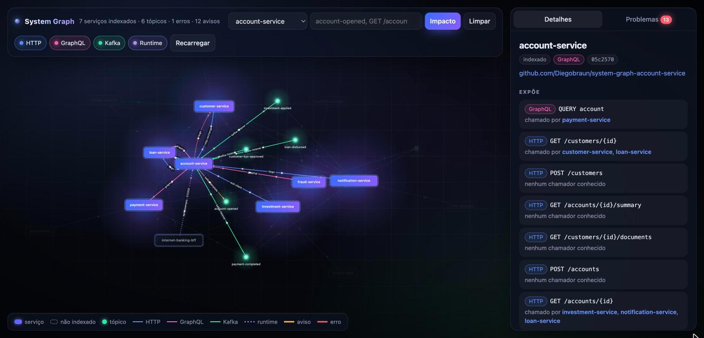

# account-service

Serviço de clientes e contas. Usa **spring-kafka** direto (`KafkaTemplate` e `@KafkaListener`), expõe REST e
**GraphQL** (Spring for GraphQL) e chama o loan-service e o customer-service com **OpenFeign**.



*O account-service na [interface visual](https://github.com/Diegobraun/system-graph-poc#interface-visual) da plataforma: tudo que ele chama, expõe, publica e consome.*

## Contratos

| Tipo | Contrato | Detalhe |
|---|---|---|
| REST exposto | `POST /customers` | cria cliente com `name`, `document`, `monthlyIncome` |
| REST exposto | `GET /customers/{id}` | chamado pelo loan-service e pelo customer-service |
| REST exposto | `GET /customers/{id}/kyc` | resultado do KYC, busca no customer-service |
| REST exposto | `GET /customers/{id}/documents` | documentos do KYC, busca no customer-service (ver [o erro proposital](#o-erro-proposital)) |
| REST exposto | `POST /accounts` | abre conta `PENDING_KYC` para um cliente e publica `account-opened` |
| REST exposto | `GET /accounts/{id}` | chamado pelo loan-service, investment-service e notification-service |
| REST exposto | `GET /accounts/{id}/summary` | saldo e empréstimos da conta, busca os empréstimos no loan-service |
| GraphQL exposto | `query customer(id)` / `query account(id)` | schema em [`schema.graphqls`](src/main/resources/graphql/schema.graphqls); `Customer.accounts` resolvido por `@SchemaMapping`. Chamado pelo loan-service, payment-service e fraud-service |
| REST chamado | `GET /loans?accountId=` no loan-service | `LoanClient`, `@FeignClient(name = "loan-service")` |
| REST chamado | `GET /kyc/{customerId}` no customer-service | `KycClient`, `@FeignClient(name = "customer-service")` |
| REST chamado | `GET /kyc/{customerId}/documents` no customer-service | `KycClient`, mesmo client. O customer-service não expõe esse endpoint |
| Kafka publica | `account-opened` | `AccountOpenedEvent(accountId, customerId, openedAt)` via `KafkaTemplate` |
| Kafka consome | `loan-disbursed` | `LoanDisbursedEvent`, credita o valor na conta (idempotente por `loanId`) |
| Kafka consome | `customer-kyc-approved` | `CustomerKycApprovedEvent`, ativa a conta |
| Kafka consome | `payment-completed` | `DebitEvents.PaymentCompleted`, debita o Pix (idempotente por `paymentId`) |
| Kafka consome | `investment-applied` | `DebitEvents.InvestmentApplied`, debita a aplicação (idempotente por `investmentId`) |

GraphQL fica em `http://localhost:8081/graphql`.

O tópico publicado vem de uma constante (`Topics.ACCOUNT_OPENED`) e os consumidos de propriedades
(`${app.topics.loan-disbursed}` e os demais). Os dois casos são de propósito, para exercitar o extrator.

## Ciclo da conta

- A conta abre como `PENDING_KYC`. O customer-service consome `account-opened`, roda o KYC e, se aprovar,
  publica `customer-kyc-approved`. Só aí a conta vira `ACTIVE`.
- Empréstimo e Pix exigem conta `ACTIVE`, então dependem do KYC ter passado.
- O débito não valida saldo aqui. Quem valida é o payment-service e o investment-service, antes de publicar.

## O erro proposital

`KycClient.documents` chama `GET /kyc/{customerId}/documents`, que o customer-service não expõe. Em runtime o
`GET /customers/{id}/documents` responde erro. O `find_contract_issues` do MCP server da plataforma aponta a
chamada como erro antes disso, cruzando o client daqui com os endpoints extraídos do customer-service.

## Configuração relevante

- `spring.application.name: account-service`: identifica o serviço no grafo.
- `spring.kafka.consumer.group-id: account-service`: mesmo nome, para cruzar com o runtime do Kafka.
- `spring.json.add.type.headers: false`: o evento não carrega o nome da classe Java, então o consumidor usa a
  própria classe. É isso que permite a divergência de payload com o loan-service passar despercebida em runtime.

## Rodando sozinho

```bash
mvn spring-boot:run
```

Porta 8081. Precisa do Kafka em `localhost:9092`, do loan-service em `localhost:8082` para o `/summary` e do
customer-service em `localhost:8083` para `/kyc`, `/documents` e para a conta sair de `PENDING_KYC`.
O Kafka sobe com o `docker-compose.yml` da [plataforma](https://github.com/Diegobraun/system-graph-poc), e o
`scripts/start-all.sh` de lá sobe todos os serviços juntos.

## Integração com IA

`.mcp.json` aponta para o MCP server do grafo e o `CLAUDE.md` orienta o assistente a consultar
`impact_of_change` antes de mexer em contratos.

## Parte da POC system-graph

Este repositório é um dos serviços da POC [system-graph](https://github.com/Diegobraun/system-graph-poc), que dá a assistentes de IA uma visão
dos contratos entre serviços que vivem em repositórios diferentes.

| Repositório | Papel |
|---|---|
| [system-graph-poc](https://github.com/Diegobraun/system-graph-poc) | Plataforma: extrator, MCP server, templates de CI, docker-compose e docs |
| [system-graph-account-service](https://github.com/Diegobraun/system-graph-account-service) | Clientes e contas |
| [system-graph-loan-service](https://github.com/Diegobraun/system-graph-loan-service) | Empréstimos |
| [system-graph-customer-service](https://github.com/Diegobraun/system-graph-customer-service) | KYC e perfil de risco |
| [system-graph-payment-service](https://github.com/Diegobraun/system-graph-payment-service) | Pagamentos Pix |
| [system-graph-notification-service](https://github.com/Diegobraun/system-graph-notification-service) | Notificações |
| [system-graph-investment-service](https://github.com/Diegobraun/system-graph-investment-service) | Investimentos |
| [system-graph-fraud-service](https://github.com/Diegobraun/system-graph-fraud-service) | Antifraude |

### O que este repositório tem para o grafo

- **`.github/workflows/system-graph.yml`**: a cada push na `main`, compila, baixa o `graph-extractor.jar` da
  release da plataforma, extrai o `service-graph.json` e publica como artefato do workflow. Se os secrets
  `NEO4J_URI`, `NEO4J_USER` e `NEO4J_PASSWORD` existirem, também grava no Neo4j.
- **`.gitlab-ci.yml`**: o mesmo job no formato GitLab, incluindo o template da plataforma. É o que um serviço da
  empresa teria.
- **`.mcp.json`** e **`CLAUDE.md`**: conectam o assistente ao MCP server e dizem quando consultar o grafo.

O extrator só enxerga este repositório. O cruzamento com os outros serviços acontece no grafo central.
